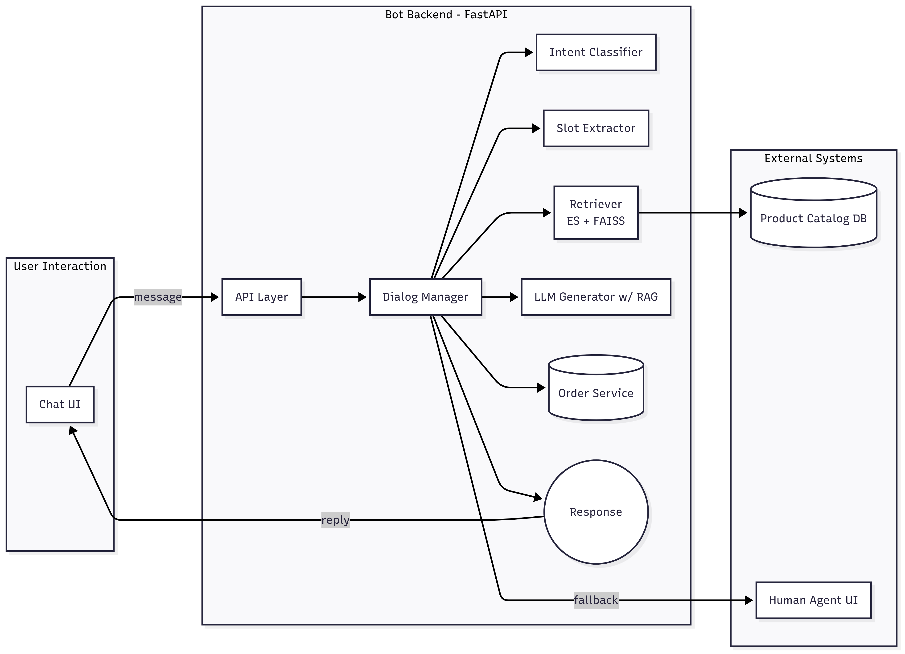
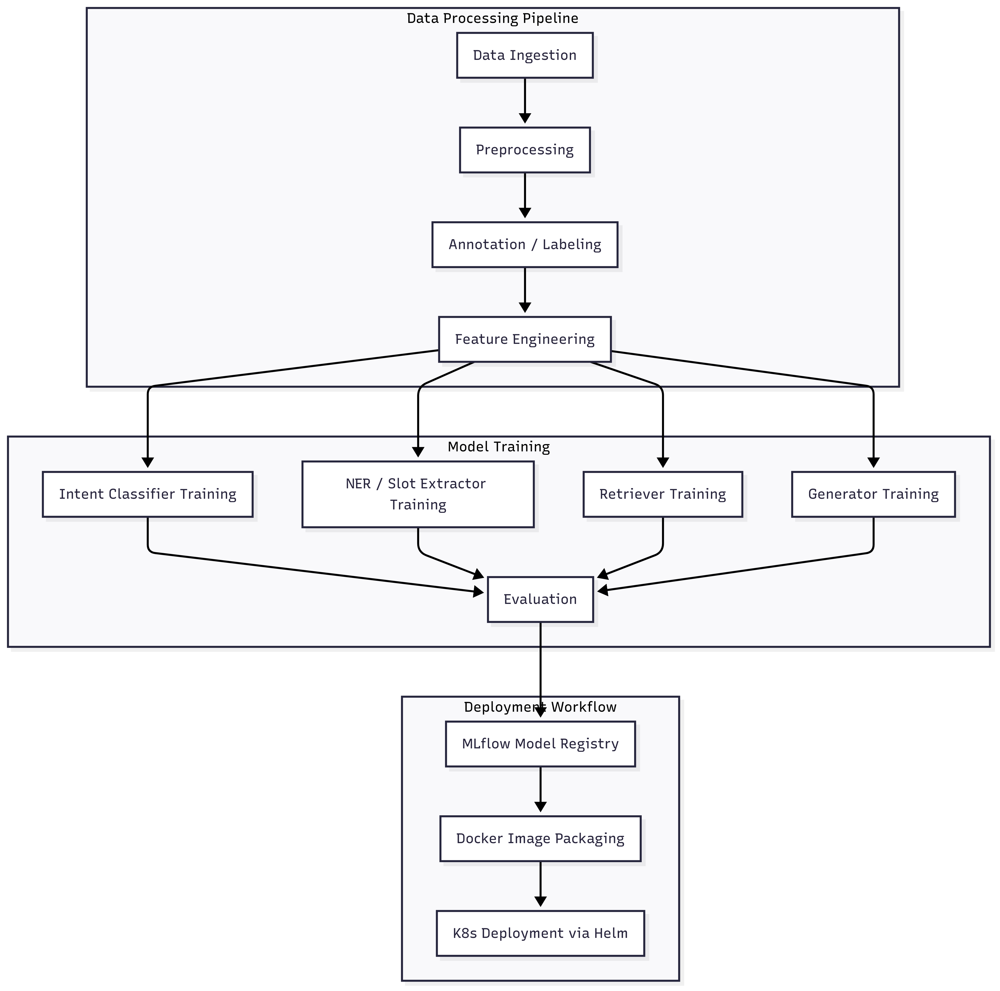

Production-Ready E-commerce Chatbot

This repository contains the complete source code and infrastructure for building, deploying, and maintaining a production-grade conversational AI chatbot for e-commerce. The system is built on a modern, open-source MLOps stack, designed for scalability, reproducibility, and continuous improvement.

!(https://img.shields.io/badge/build-passing-brightgreen)

## Key Features

- **Intent Classification**: Understands user goals (e.g., `track_order`, `place_order`, `refund`).
    
- **Named Entity Recognition (NER)**: Extracts key information from user queries (e.g., `product`, `size`, `order_id`).
    
- **Hybrid Retrieval**: Combines keyword-based (sparse) and semantic (dense) search for robust FAQ and product catalog lookups.
    
- **Generative Responses (RAG)**: Uses a Retrieval-Augmented Generation approach with a small LLM to provide context-aware, natural-sounding answers.
    
- **Dialog State Management**: Maintains conversation context for multi-turn interactions.
    
- **Human Escalation**: A built-in mechanism to hand off complex conversations to a human agent.
    
- **End-to-End MLOps**: Fully automated pipelines for data processing, model training, deployment, monitoring, and retraining.
    

## System Architecture

### 1. System Data Flowmermaid



### 2. Training Pipeline



## Tech Stack

|Component|Technology|
|---|---|
|**ML Frameworks**|PyTorch Lightning, Hugging Face Transformers, spaCy|
|**API & Serving**|FastAPI, Gunicorn, Uvicorn|
|**Data Versioning**|DVC + Git|
|**Workflow Orchestration**|Prefect OSS|
|**Experiment Tracking**|MLflow OSS|
|**Storage (Artifacts/Data)**|MinIO (S3-Compatible)|
|**Databases**|PostgreSQL, Elasticsearch, FAISS, Redis|
|**Streaming**|Kafka + Zookeeper|
|**Containerization**|Docker, Docker Compose|
|**Deployment**|Kubernetes (K3s/Minikube), Helm|
|**CI/CD**|GitHub Actions|
|**Monitoring**|Prometheus, Grafana, Evidently AI|

## Getting Started (Local Development)

### Prerequisites

- Docker and Docker Compose
    
- Conda or a Python virtual environment manager
    
- Git
    

### 1. Clone the Repository

```bash
git clone [https://github.com/your-username/ecommerce-chatbot.git](https://github.com/your-username/ecommerce-chatbot.git)
cd ecommerce-chatbot
```

### 2. Configure Environment Variables

Copy the example environment file and update it with your desired credentials. The defaults are suitable for local development.

```bash
cp.env.example.env
```

### 3. Launch the Infrastructure

This command will start all the necessary backend services (Postgres, MinIO, MLflow, Kafka, etc.) in Docker containers.

```bash
docker compose up -d --build
```

You can now access the services at:

- **MLflow UI**: `http://localhost:5000`
    
- **MinIO Console**: `http://localhost:9001` (Login with credentials from `.env`)
    
- **Prefect UI**: `http://localhost:4200`
    
- **Grafana**: `http://localhost:3000`
    

### 4. Run the Data and Training Pipeline

This project uses DVC to manage the data pipeline and Prefect to orchestrate it.

First, pull the initial data from the DVC remote (MinIO):


```bash
dvc pull
```

To run the full data processing and model training pipeline, execute the Prefect flow:

```bash
python services/worker/flows/main_pipeline.py
```

## Usage Example

Once the API service is running (either via `docker compose up api` or deployed to Kubernetes), you can interact with it using `curl`.

**Generate a response from the chatbot:**

```bash
curl -X POST "http://localhost:8000/generate_response" \
-H "Content-Type: application/json" \
-d '{
  "session_id": "user123",
  "message": "Hi, I want to know the status of my order."
}'
```

## Project Structure

```
/infra/          # K8s manifests, Helm charts
/services/api/   # FastAPI inference & webhook handlers
/services/worker/  # Prefect flows for batch jobs (ingest, retrain)
/ml/             # Training code, utils, models
/dvc/            # Data pipeline configs (dvc.yaml)
/docs/           # README, diagrams, model cards
/ci/             # GitHub Actions workflows
...
```

## Contributing

Please refer to `CONTRIBUTING.md` for guidelines on how to contribute to this project.

## License

This project is licensed under the MIT License. See the `LICENSE` file for details.
